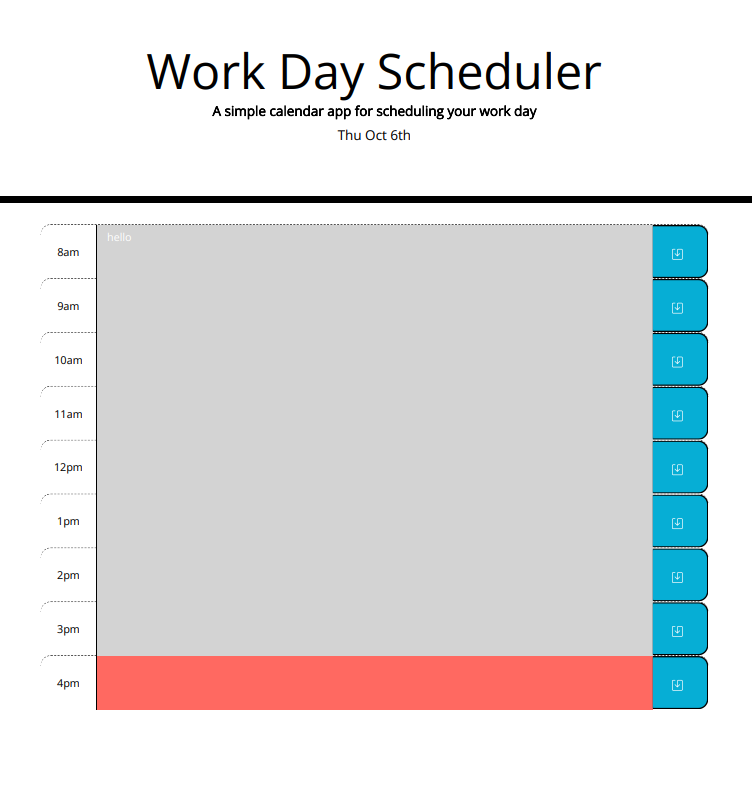

# work-day-scheduler
# Description
This application is a work day scheduler, designed to help you stay on track of your tasks for the day. 
It is interactive. You can write and save quickly and update quickly. 
It shows which hour block you are in and which have past and are to come. 
## Installation
This a website with a live url that you can access by following this link
https://jonathanlevi14.github.io/work-day-scheduler/
## Usage
This screenshot shows you what the page will look like upon load.

You can enter text into the middle boxes and make sure to save by pressing the save icon to the right of the text area. The note will be saved in local storage and avialable to you on your machine when you come back to the page later.
The grey color means that the time slot has passed, the red color is the time you are on, and the green color is the hour block that are ahead of you in the word day.

## Credits
This project was made possible by the help of my classmates in the bootcamp, my TA's, and my tutor.
I also used W3School website, Mozilla Developer network, as well as reading queries on StackOverflow.
## License
This project is licensed under the MIT license. 
## Features
The clock is always set to you date, and the hours change according to your timezone via Moment.js
The structure of the blocks and grid is made possible by bootstrap4.5
Jquery was also used for some of the functions. 

## How to Contribute

If you  would like to contribute to it, you can. Check out the  included guidelines for how to do so. The [Contributor Covenant](https://www.contributor-covenant.org/) is an industry standard.

